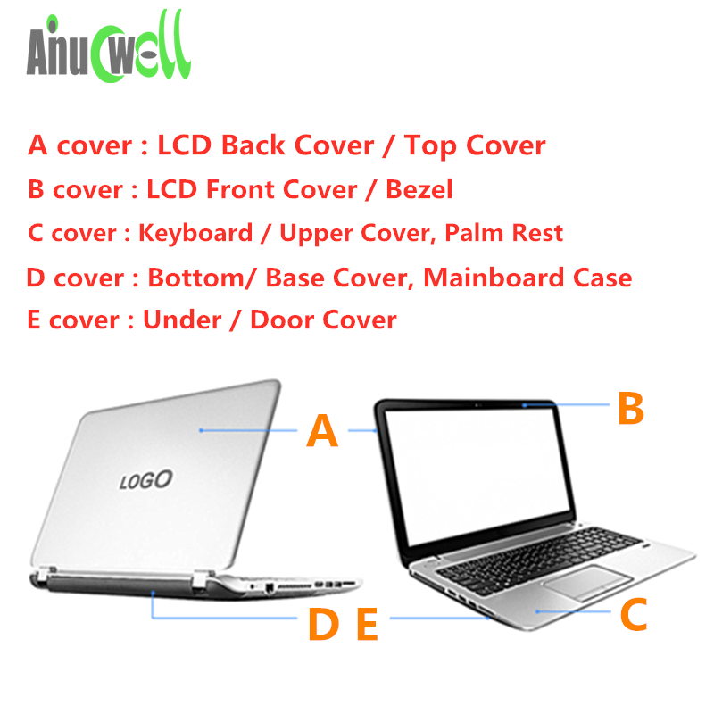

[Laptop Mag: Find the Perfect Laptop, Tablet or 2-in-1 for You](https://www.laptopmag.com/)
[广州笔记本乐园官方网站 广州二手 IBM/Thinkpad 笔记本电脑 专卖二手 Thinkpad 笔记本 二手笔记本论坛 二手笔记本网站 Thinkpad 笔记本电脑 - Powered by Discuz!](http://www.lybook.com.cn/forum.php)
[cyber-pro](http://www.cyber-system-pro.com.hk/)
[Compare Laptops - Latest laptop Comparison by Price, Specification, Features, Performance & Reviews | Gadgets Now](https://www.gadgetsnow.com/compare-laptops)

A: LCD Back Cover
B: Front bezel
C: Palmrest
D: Bottom Case

[2019 年 10 款轻薄笔记本推荐：这些真的不错，值得等待 - 知乎](https://zhuanlan.zhihu.com/p/54727484)

[Mobile Internet device - Wikiwand](https://www.wikiwand.com/en/Mobile_Internet_device)
[Ultra-mobile PC - Wikiwand](https://www.wikiwand.com/en/Ultra-mobile_PC)
[Ultrabook - Wikiwand](https://www.wikiwand.com/en/Ultrabook)

## Lenovo

[ThinkWiki](https://www.thinkwiki.org/wiki/ThinkWiki)

Lookup spec by product ID
[partslookup - HK](https://support.lenovo.com/hk/en/partslookup)
[Home - Global Support - US](https://support.lenovo.com/us/en/)
[Product Specifications Reference(PSREF)](http://psref.lenovo.com/)

[[ROM][ICS]Ideapad K1 Official Release - Lenovo Community](https://forums.lenovo.com/t5/Lenovo-Android-based-Tablets-and/ROM-ICS-Ideapad-K1-Official-Release/td-p/810399)

[THINK: A brief history of ThinkPads, from IBM to Lenovo - NotebookCheck.net News](https://www.notebookcheck.net/THINK-A-brief-history-of-ThinkPads-from-IBM-to-Lenovo.418728.0.html)
[ThinkPad 综合站 - 知乎](https://zhuanlan.zhihu.com/thinkpad)
[2019 年 ThinkPad X390、T490、T490s 新機速報！ - 知乎](https://zhuanlan.zhihu.com/p/58196612)
[Lenovo ThinkPad T480s vs. Lenovo ThinkPad X1 Carbon | Digital Trends](https://www.digitaltrends.com/computing/lenovo-thinkpad-t480s-vs-lenovo-thinkpad-x1-carbon/)

[How to upgrade the SSD in Lenovo's ThinkPad X1 Carbon | Windows Central](https://www.windowscentral.com/how-upgrade-ssd-lenovo-thinkpad-x1-carbon?amp)

[Lenovo Thinkpad X1 Carbon - Battery Replacement - YouTube](https://www.youtube.com/watch?v=ic6nqacxd9o)
[ThinkPad: X Series Laptops-Lenovo Community](https://forums.lenovo.com/t5/ThinkPad-X-Series-Laptops/Battery-Not-Detected-2019-Thinkpad-X1-Carbon-7th-Gen-20QD/m-p/5010935)
[power management - Lenovo X1 Thinkpad battery not charging in 17.04 - Ask Ubuntu](https://askubuntu.com/questions/980490/lenovo-x1-thinkpad-battery-not-charging-in-17-04)

## 13.3"

[The Best 13-Inch Laptops of 2019: Portable Notebooks for Any Budget](https://www.laptopmag.com/articles/best-13-inch-laptops)

[MacBook Air - Technical Specifications - Apple (HK)](http://www.apple.com/hk/en/macbook-air/specs.html)
Core i5-5250U 8GB 13.3" 1440x900 128GB 7150mAh/54Wh 1.35kg $7488
Core i5-5250U 8GB 13.3" 1440x900 256GB 7150mAh/54Wh 1.35kg $8988

[Asus ZenBook 13 UX333FA - Full Review and Benchmarks](https://www.laptopmag.com/reviews/laptops/asus-zenbook-13-ux333fa)
[HP Spectre 13 (8th Gen Core) Review: Crazy Sleek, So-So Battery](https://www.laptopmag.com/reviews/laptops/hp-spectre-13)

[HUAWEI MateBook 13, 極致輕盈手提電腦, 藍光過濾屏幕 | HUAWEI 香港](https://consumer.huawei.com/hk/laptops/matebook-13/)
USB-C only, no HDMI, USB-C charging, no Thunderbolt 3, touchscreen
[Huawei MateBook 13 vs. MateBook X Pro: What's the difference? - NotebookCheck.net News](https://www.notebookcheck.net/Huawei-MateBook-13-vs-MateBook-X-Pro-What-s-the-difference.396991.0.html)
[Huawei MateBook 13 Review: Best MacBook Air Rival for PC Users? - YouTube](https://www.youtube.com/watch?v=Qm71ynoNNdg)
[Huawei MateBook 13 review | TechRadar](https://www.techradar.com/reviews/huawei-matebook-13)
[HUAWEI Matebook 13 (i5/8GB/256GB) 價錢、規格及用家意見 - 香港格價網 Price.com.hk](https://www.price.com.hk/product.php?p=394808)
Intel i5-8265U, 8GB RAM, 13" 2160x1440 IPS, 256GB M.2 NVMe SSD, Intel 620, 41.8Wh, 1.28kg \$6650
[Huawei MateBook 13 (i7-8565U, GeForce MX150) Laptop Review - NotebookCheck.net Reviews](https://www.notebookcheck.net/Huawei-MateBook-13-i7-8565U-GeForce-MX150-Laptop-Review.395006.0.html) > [HUAWEI Matebook 13 (i7/8GB/512GB) 價錢、規格及用家意見 - 香港格價網 Price.com.hk](https://www.price.com.hk/product.php?p=394809&gp=18)
Intel i7-8565U, 8GB RAM, 13" 2160x1440 IPS, 512GB M.2 NVMe SSD, Intel 620 + GeForce MX150, 41.8Wh, 1.28kg \$7950

[HUAWEI MateBook X | 電腦及平板 | HUAWEI Hong Kong](https://consumer.huawei.com/hk/laptops/matebook-x/)
[Huawei MateBook X (i5-7200U, 256 GB) Subnotebook Review - NotebookCheck.net Reviews](https://www.notebookcheck.net/Huawei-MateBook-X-i5-7200U-256-GB-Subnotebook-Review.237174.0.html)
[HUAWEI Matebook X i5-7200 8G+512GB 價錢、規格及用家意見 - 香港格價網 Price.com.hk](https://www.price.com.hk/product.php?p=265209)
Intel i5-7200U, 8GB RAM, 13" 2160x1440 IPS, 256GB NVMe? SSD, Intel 620, 41.4Wh, 1.05kg \$9390
hidden webcam, fanless, upward speaker, 450 nits display

[Lenovo ThinkPad X390 | Ultra-mobile 13.3” business laptop | Lenovo HK](https://www.lenovo.com/hk/en/laptops/thinkpad/thinkpad-x-series/X390/p/22TP2TX3900)
[PSREF ThinkPad ThinkPad X390](http://psref.lenovo.com/Product/ThinkPad/ThinkPad_X390)
[Lenovo ThinkPad X390 (i5-8265U, FHD) Laptop Review - NotebookCheck.net Reviews](https://www.notebookcheck.net/Lenovo-ThinkPad-X390-i5-8265U-FHD-Laptop-Review.419740.0.html)
Intel i5-8265U, 8GB RAM, 13" 1920x1080 IPS, 256GB NVMe SSD, Intel 620, 48Wh, 1.22 kg \$9850
Intel i5-8265U, 8GB RAM, 13" 1920x1080 IPS, 512GB NVMe SSD, Intel 620, 48Wh, 1.22 kg \$10550
Touch +\$850

[NP910S3L-M01HK](http://www.samsung.com/hk_en/consumer/computer-peripherals/personal-computers/notebook/NP910S3L-M01HK?subsubtype=notebook-9)
[Samsung NP910S3L-M01HK 價格、規格及用家意見 - 香港格價網 Price.com.hk](http://www.price.com.hk/product.php?p=232912)
Core i5-6200U 8GB 13.3" 1920x1080 256GB 30Wh 1.3kg \$6390

[NP900X3TI | NP900X3T-U01HK | HK_EN](https://www.samsung.com/hk_en/pc/notebook-9-always-np900x3t-u01/NP900X3T-U01HK/)
[Samsung NP900X3T-U01HK 價錢、規格及用家意見 - 香港格價網 Price.com.hk](https://www.price.com.hk/product.php?p=375791)
[Price 限時購 - Samsung Notebook 9 Always 13.3" 筆記型電腦 (CB-NP900X3T-U01HK) [鈦銀色]](https://www.price.com.hk/ec-product-detail.php?list_id=97&ecpid=94943)
Core i7-8550U 8GB 13.3" 1920x1080 512GB 75Wh 0.99kg \$8988

[Librem 13 – Purism](https://puri.sm/shop/librem-13/)
Core i5-5200U 8GB 13.3" 1920x1080 250GB ?Wh 802.11n 1.4kg USD\$1499

[Apollo](https://www.entroware.com/store/apollo)
Core i5-6200U 8GB 13.3" 1920x1080 250GB 6300mAh 1.42kg £729.97

## 2 in 1

[Best 2-in-1 Laptops of 2019 - Laptop/Tablet Hybrids - Laptop Mag](https://www.laptopmag.com/articles/best-2-in-1-laptops)

[HP Spectre x360 (13-inch, 2019) - Full Review and Benchmarks](https://www.laptopmag.com/reviews/laptops/hp-spectre-x360-13-inch-2019) 12"
[LG Gram 14 2-in-1 - Full Review and Benchmarks](https://www.laptopmag.com/reviews/laptops/lg-gram-14-2-in-1) 14"
[Asus ZenBook Flip S - Full Review and Benchmarks](https://www.laptopmag.com/reviews/laptops/asus-zenbook-flip-s)
[Asus ZenBook Flip 14: Full Review and Benchmarks](https://www.laptopmag.com/reviews/laptops/asus-zenbook-flip-14)

[Lenovo Yoga 720-13IKBR (81C3004NHH) 價格、規格及用家意見 - 香港格價網 Price.com.hk](https://www.price.com.hk/product.php?p=279300)
Intel i5-8250U, 8GB RAM, 13.3" 1920x1080 IPS, 256GB SSD, Intel 620, 51Wh, 1.4kg \$7718

[Lenovo Yoga 720-13IKBR (81C3004MHH) 價格、規格及用家意見 - 香港格價網 Price.com.hk](https://www.price.com.hk/product.php?p=279301)
Intel i7-8550U, 8GB RAM, 13.3" 1920x1080 IPS, 256GB SSD, Intel 620, 51Wh, 1.4kg \$8799

[ThinkPad X380 Yoga | Versatile 13.3” Business 2-in-1 | Lenovo HK](https://www.lenovo.com/hk/en/laptops/thinkpad/thinkpad-x-series/ThinkPad-X380-Yoga/p/22TP2TXX380)
[Lenovo ThinkPad X380 Yoga 20LHS00Q00 價格、規格及用家意見 - 香港格價網 Price.com.hk](https://www.price.com.hk/product.php?p=293980)
Intel i5-8250U, 8GB RAM, 13.3" 1920x1080 IPS, 256GB SSD, Intel 620, 51Wh, 1.3kg \$9999

[Microsoft Surface Pro 2017 (i5 / 256GB / 8GB) with Keyboard cover 價格、規格及用家意見 - 香港格價網 Price.com.hk](https://www.price.com.hk/product.php?p=263326)
Intel i5-7300U, 8GB RAM, 12.3" 2736x1824 PixelSense, 256GB SSD, Intel 620, ?Wh 13hr, 1.3kg \$9080

[Microsoft Surface Pro 2017 (i7 / 256GB / 8GB) with Keyboard cover 價格、規格及用家意見 - 香港格價網 Price.com.hk](https://www.price.com.hk/product.php?p=265542)
Intel i7-7660U, 8GB RAM, 12.3" 2736x1824 PixelSense, 256GB SSD, Intel 640, ?Wh 13hr, 1.3kg \$10880

[Microsoft Surface Book 2 13.5" (i5/256GB SSD/8GB RAM) 價格、規格及用家意見 - 香港格價網 Price.com.hk](https://www.price.com.hk/product.php?p=280751)
Intel i5-7300U, 8GB RAM, 13.5" 3000x2000 PixelSense, 256GB SSD, Intel 640, ?Wh 17hr, 1.576kg \$7610

[Microsoft Surface Book 2 13.5" (i7/256GB SSD/8GB RAM/GTX1050) 價格、規格及用家意見 - 香港格價網 Price.com.hk](https://www.price.com.hk/product.php?p=280753)
Intel i7-8650U, 8GB RAM, 13.5" 3000x2000 PixelSense, 256GB SSD, GeForce GTX 1050, ?Wh 17hr, 1.642kg \$15999

[ASUS VivoBook Flip 14 TP410UR-EC068T 價格、規格及用家意見 - 香港格價網 Price.com.hk](https://www.price.com.hk/product.php?p=281383)
Intel i5-7200U, 8GB RAM, 14" 1920x1080 IPS, 128GB SSD+1TB HDD, GeForce 930MX 2GB, ?Wh, 1.6kg \$7630

[ASUS VivoBook Flip 14 TP410UR-EC069T 價格、規格及用家意見 - 香港格價網 Price.com.hk](https://www.price.com.hk/product.php?p=281384)
Intel i7-7500u, 16GB RAM, 14" 1920x1080 IPS, 256GB SSD+1TB HDD, GeForce 930MX 2GB, ?Wh, 1.6kg \$8950

## > 13"

[Best 15-inch Laptops 2019](https://www.laptopmag.com/articles/best-15-inch-laptops)

[LG Gram Review - Full Review and Benchmarks](https://www.laptopmag.com/reviews/laptops/lg-gram) 14" touch screen
[Acer Swift 7 (2018)- Full Review and Benchmarks](https://www.laptopmag.com/reviews/laptops/acer-swift-7) 14" touch screen, fanless
[Acer Swift 5 (2019) - Full Review and Benchmarks](https://www.laptopmag.com/reviews/laptops/acer-swift-5-2019) 15.6" touch screen
[Asus ZenBook 14 UX433 - Full Review and Benchmarks](https://www.laptopmag.com/reviews/laptops/asus-zenbook-14-ux433fa)
[Asus ZenBook UX430UA Review: Excellent Ultraportable for the Money](https://www.laptopmag.com/reviews/laptops/asus-zenbook-ux430) 14", micro HDMI, no USB-C charging

[HUAWEI MateBook 14, Long Battery Life, Ultra-Slim Notebook | HUAWEI Global](https://consumer.huawei.com/en/laptops/matebook-14/)
[Huawei MateBook 14 Review: A Quality 14" Ultrabook … With Some Quirks - YouTube](https://www.youtube.com/watch?v=4Alwv78N0VA)
[Huawei MateBook 14 review | TechRadar](https://www.techradar.com/reviews/huawei-matebook-14-review)
Intel i5-7200U, 8GB RAM, 13" 2160x1440 IPS, 256GB NVMe SSD, Intel 620, 57.4Wh, 1.49kg £1,040
Intel i7-8565U, 8GB RAM, 14" 2160x1440 IPS, 512GB M.2 NVMe SSD, Intel 620 + GeForce MX250, 57.4Wh, 1.49kg, £1,300
touchscreen, hidden webcam, Thunderbolt 3, 2 USB-A, USB-C charging, same spec as MateBook X Pro but cheaper

[Lenovo ThinkPad T490s | Thin, light, & packed with features | Lenovo HK](https://www.lenovo.com/hk/en/laptops/thinkpad/thinkpad-t-series/ThinkPad-T490s/p/22TP2TT490S)
[有關 《ThinkPad T490s》的搜尋結果 - 香港格價網 Price.com.hk](https://www.price.com.hk/search.php?g=A&q=ThinkPad+T490s)
Intel i5-8265U, 8GB RAM, 14" 1920x1080 IPS, 256GB M.2 NVMe SSD, Intel 620, 57.4Wh, 1.27kg, $10,380
Intel i5-8265U, 8GB RAM, 14" 1920x1080 IPS, 512GB M.2 NVMe SSD, Intel 620, 57.4Wh, 1.27kg, $10,910
Thunderbolt 3, 2 USB-A, USB-C charging, 328.8mm x 226.15mm x 16.7mm, low power pane @400nit

[Lenovo ThinkPad X1 Carbon (6th Gen) | Premium Ultrabook for Productive Professionals | Lenovo HK](https://www.lenovo.com/hk/en/laptops/thinkpad/thinkpad-x-series/ThinkPad-X1-Carbon-6th-Gen/p/22TP2TXX16G)
[有關 《Lenovo ThinkPad X1 Carbon G6》的搜尋結果 - 香港格價網 Price.com.hk](https://www.price.com.hk/search.php?g=A&q=Lenovo+ThinkPad+X1+Carbon+G6)
[Lenovo ThinkPad X1 Carbon G6 Series - Notebookcheck.net External Reviews](https://www.notebookcheck.net/Lenovo-ThinkPad-X1-Carbon-G6-Series.341146.0.html)
[Lenovo ThinkPad X1 Carbon G6 2018 (i5-8350U, Full-HD Touch, 256GB) Laptop Review - NotebookCheck.net Reviews](https://www.notebookcheck.net/Lenovo-ThinkPad-X1-Carbon-G6-2018-i5-8350U-Full-HD-Touch-256GB-Laptop-Review.331428.0.html)
[cyber-pro lenovo](http://www.cyber-system-pro.com.hk/nb_lenovo.htm)
[cyber-system-pro X1 Carbon G6](http://www.cyber-system-pro.com.hk/order_from.php?part_num=20KHS16P00&nb_id=356)
Intel i5-8250U, 8GB RAM, 14" 1920x1080 IPS, 256GB NVMe SSD, Intel 620, 52Wh, 1.13 kg \$9990 ($11849)
Intel i5-8250U, 8GB RAM, 14" 1920x1080 IPS, 512GB NVMe SSD, Intel 620, 52Wh, 1.13 kg \$11630 ($12499)
6th gen, Thunderbolt 3, 2 USB-A, USB-C charging, 323.5mm x 217.1mm x 15.95mm

[LG 14Z960 | 14 吋 個人電腦 | LG 香港](https://www.lg.com/hk/personal-computers/lg-14Z960)
[LG gram 14Z960-G.AA5WC1 (White) 價錢、規格及用家意見 - 香港格價網 Price.com.hk](https://www.price.com.hk/product.php?p=236976)
Core i5-6200U 8GB 14.1" 1920x1080 256GB 34Wh 0.98kg \$11980

[Swift SF314-52-53AX](https://www.acer.com/datasheets/2017/4876/SF314-52/NX.GNUAA.002.html)
[Acer SF314-52-53AX (Windows10 Creators Update Version) 價格、規格及用家意見 - 香港格價網 Price.com.hk](https://www.price.com.hk/product.php?p=275792)
Core i5-7200U 8GB 14" 1920x1080 Touch IPS 256GB 48Wh 1.8kg \$4490

[ASUSPRO P5430UA-FA0132E-Dark Grey >ASUS U](http://store.asus.com/uprogramhk/item/201607AM280001548)
Core i5-6200U 8GB 14" 1920x1080 512GB+1TB 46Wh 1.76kg \$4500 (U program)

## Framework

[A COMPLETELY Upgradeable Laptop? - YouTube](https://www.youtube.com/watch?v=0rkTgPt3M4k)
[This Is How All Laptops Should Be Made!! - Framework Laptop Teardown - YouTube](https://www.youtube.com/watch?v=QmyAUIo79EU)
[The Framework Laptop is a Risky Gamble... But I Love It. - YouTube](https://www.youtube.com/watch?v=jmgBwMHpP1w)

## Chromebook

[Chrome Unboxed | Chromebooks | Chromecast | Assistant | News](https://chromeunboxed.com/)
[2019 Chromebook Comparison Chart](https://www.chromebookchart.com/)
[Chromebook Comparison and 2021 Buyer's Guide](https://www.starryhope.com/chromebooks/chromebook-comparison-chart/)
[Best Chromebook in 2021 | ZDNet](https://www.zdnet.com/article/best-chromebook-2021/)
[TOP 5: Best Chromebook 2019 - YouTube](https://www.youtube.com/watch?v=8p3yqI-0520)
[2021 年 Chromebook 選購活用：Chrome OS 操作介面又進化、跨裝置接軌使用 Android 裝置 | T 客邦](https://www.techbang.com/posts/89854-what-to-know-before-purchasing-a-chromebook-a-pen-option-other)
The best Chromebook you can buy (2016): Acer Chromebook R11

[From Netbooks To Desktop Replacements - The History Of Chrome OS | Android Headlines](https://www.androidheadlines.com/amp/2019/05/google-chrome-os-entire-history.html)

[Lenovo ThinkPad 13 Chromebook 價格、規格及用家意見 - 香港格價網 Price.com.hk](http://www.price.com.hk/product.php?p=242934) $2698
[Acer Chromebook R 11 價格、規格及用家意見 - 香港格價網 Price.com.hk](http://www.price.com.hk/product.php?p=230709) $2698

[\$2,200 有找硬撼 iPad 聯想 IdeaPad Duet Chromebook 上市 - ePrice.HK 流動版](https://m.eprice.com.hk/nb/talk/1078/27156/1/) \$2200
