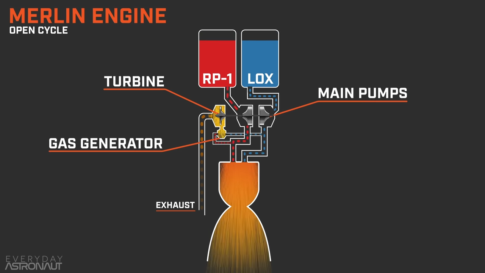
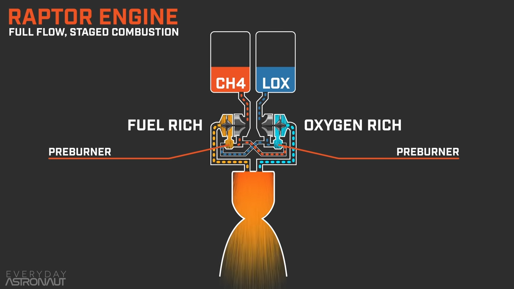

[Engine - Wikiwand](http://www.wikiwand.com/en/Engine) a machine that converts one form of energy to mechanical energy

[Engines | HowStuffWorks](http://auto.howstuffworks.com/car-engine-information-channel.htm)
[Inside Engines | HowStuffWorks](https://auto.howstuffworks.com/inside-engines-roundup.htm)

[Gear Quest - YouTube](https://www.youtube.com/channel/UC594mp4ZsrTH5dLBfZAglhw)
[Science Garage - Cars Down to the Atom - YouTube](https://www.youtube.com/playlist?list=PLFl907chpCa7R39l29VY5DygA8RgBQZBf) Donut Media on car techs
[Autotechlabs - YouTube](https://www.youtube.com/channel/UCtfVcXWhbSnF-fWHJ6ugw5A)
[driving 4 answers - YouTube](https://www.youtube.com/c/mr2mk1hero/featured)

[Animated Engines - Home](http://www.animatedengines.com/)
[Animated Engines](http://www.mekanizmalar.com/menu-engine.html)

Engineering Explained !important
[Engineering Explained - YouTube](https://www.youtube.com/user/EngineeringExplained/playlists?view=50&sort=dd&shelf_id=2)
[Engines - YouTube](https://www.youtube.com/playlist?list=PL30C950600B683799)
[Engine Components and Features - YouTube](https://www.youtube.com/playlist?list=PL1C4B9B13E1EAC364)

[Engine Placement EXPLAINED - YouTube](https://www.youtube.com/watch?v=SiOSbHo2dvk)

[Toyota's New Dynamic Force Engine Is Super Efficient - YouTube](https://www.youtube.com/watch?v=wwLxxZm_LRQ)

## Steam Engine

[The Delightful History of Steam Technology | Stuff You Should Know](http://www.stuffyoushouldknow.com/podcasts/the-delightful-history-of-steam-technology.htm)
[How Steam Technology Works | HowStuffWorks](http://science.howstuffworks.com/steam-technology.htm/printable)
[How do Steam Engines Work? - YouTube](https://www.youtube.com/watch?v=xnClSss50pI)

## Stirling Engine

Heat difference will create pressure difference in the sealed chamber, this turns the fly wheel to produce work.

[Stirling Engines - the power of the future? - YouTube](https://www.youtube.com/watch?v=vGlDsFAOWXc)

[How to Make a Coke Can Stirling Engine | HowStuffWorks](https://auto.howstuffworks.com/coke-can-stirling-engine.htm/printable)

[【Fun 科學】熱機-下篇(史特林引擎)/淘寶開箱 - YouTube](https://www.youtube.com/watch?v=deByRlBMYhQ)
[如何用一块冰带动机器运转？带你认识外燃机——斯特林机 - YouTube](https://www.youtube.com/watch?v=mtKKlZQujEo)
[效率高，结构简单，斯特林机为什么把自己活成了稀有物种？ - YouTube](https://www.youtube.com/watch?v=nUaoZLlPrr4)

## Combustion Engine

[How Car Engines Work | HowStuffWorks](https://auto.howstuffworks.com/engine.htm)

[External combustion engine - Wikiwand](http://www.wikiwand.com/en/External_combustion_engine)
[Internal combustion engine - Wikiwand](http://www.wikiwand.com/en/Internal_combustion_engine)

[Two-stroke engine - Wikiwand](http://www.wikiwand.com/en/Two-stroke_engine)
[Four-stroke engine - Wikiwand](http://www.wikiwand.com/en/Four-stroke_engine)

1. Intake stroke (suck)
2. Compression stroke (squeeze)
3. Power stroke (bang)
4. Exhaust stroke (blow)

[Direct Injection 2-Stroke Engines | BRP USA](http://www.brp.com/en-us/innovation/eco-performance-technologies/2-stroke-engines)

[INLINE 6 vs. V6 - How it Works | SCIENCE GARAGE - YouTube](https://www.youtube.com/watch?v=JfaJ35vVQ9A)
[The Best Inline-Six Cylinder Engines Of 2020 - YouTube](https://www.youtube.com/watch?v=qiZPX_H3IG8)
[The Differences Between V6 and Straight-Six Engines - YouTube](https://www.youtube.com/watch?v=u3XSfVPFM74) How to compare engines

[How Engines Work - (SEE THROUGH ENGINE in SLOW MOTION) - Smarter Every Day 166 - YouTube](https://www.youtube.com/watch?v=xflY5uS-nnw)
[See Through Engine - YouTube](https://www.youtube.com/playlist?list=PLUBbg7VLSf-NBbeovWtd6I_pbJVpOaDhE)

[The W12 Engine - The Science EXPLAINED - YouTube](https://www.youtube.com/watch?v=AcveN3Iplww)

[JZ Vs LS - The Best Engines IN THE WORLD! - YouTube](https://www.youtube.com/watch?v=jSJ6lLwGsNU)
[Toyota JZ engine - Wikiwand](https://www.wikiwand.com/en/Toyota_JZ_engine)
[2JZ ENGINE - How it Works | SCIENCE GARAGE - YouTube](https://www.youtube.com/watch?v=Viz-GXRBj0E) 1JZ=1.5L, 2JZ=3L

[CHEVY LS ENGINE - Everything You Need to Know | Up to Speed - YouTube](https://www.youtube.com/watch?v=kxNwmClQMKs)
[LS based GM small-block engine - Wikiwand](https://www.wikiwand.com/en/LS_based_GM_small-block_engine)
[LS1, LS6,LS2, LS3, L99, LS4, LS7, LS9 And LSA Engine History - GM High-Tech Performance](http://www.superchevy.com/how-to/0901gmhtp-ls1-ls6-ls2-ls3-l99-ls4-ls7-ls9-lsa-engine-history/)
Chevy LS American made aluminum push-rod V8 engine with many configs and better support; the 5th engine is rebranded as LT
[Chevy LS: Best Engine Swap Ever? | WheelHouse - YouTube](https://www.youtube.com/watch?v=SYLgl59c_x8)

[How Koenigsegg's Tiny Engine Makes 600 Horsepower - Only 3 Cylinders! - YouTube](https://www.youtube.com/watch?v=WwlNqaz9q_0) Koenigsegg FreeValve

[This Brilliant Engine Makes 1000 HP Without Boost! - YouTube](https://www.youtube.com/watch?v=Tq2vrqqlSNg)
[The Best Way To Compare Car Engines - BMEP - YouTube](https://www.youtube.com/watch?v=bE_1JYrlYYU) Breke Mean Effective Pressure, a fancy way to measure torque per liter

### Injection

Air/Fuel (gasoline/petrol) ratio:
Rich < 14.7:1
Ideal = 14.7:1
Lean > 14.7:1

[DIESEL | How it Works - YouTube](https://www.youtube.com/watch?v=4YT0WcI7hjk)
diesel is long chain carbon; eating oil can be used in diesel engine if the injector can make them vaporize
diesel engine uses direct injection

Engineering Explained
[What's The Best Fuel Injection? Carburetors vs Port vs Direct - YouTube](https://www.youtube.com/watch?v=qms_9ZP6ORo)
Donut Media
[FUEL INJECTORS - How They Work | SCIENCE GARAGE - YouTube](https://www.youtube.com/watch?v=VgeucJ8vjAs)
[CARBURETORS | How They Work - YouTube](https://www.youtube.com/watch?v=1ohL6KgasjA)
[How Does A Carburetor Work? | Transparent Carburetor at 28,546 fps Slow Mo - Smarter Every Day 259 - YouTube](https://www.youtube.com/watch?v=toVfvRhWbj8)
[How Carburetors are Made (Basically Magic) - Holley Factory Tour | Smarter Every Day 261 - YouTube](https://www.youtube.com/watch?v=1_hFKRDDP_o)
Carburetors works because of Bernoulli's Principle; it is all mechanical and the simplest but cannot control the mixture ratio
Port injection is controlled electrically and mixes fuels _before_ it reaches the cylinder (40-90 PSI); can clean the intake valve
Direct injection is also controlled electrically but resides _within_ the cylinder and have much higher pressure (1.5-5K PSI)
[IS THERE SUCH A THING AS BETTER GAS - How it Works | SCIENCE GARAGE - YouTube](https://www.youtube.com/watch?v=S3hEuKmbPB0)

These factors can be tuned:

- Valve Timing (VVT)
- Valve Lift (VVL)
- Valve Duration (VVD)

[Variable valve timing - Wikiwand](https://www.wikiwand.com/en/Variable_valve_timing) electrical system
[Car Tech 101: Variable valve timing explained - YouTube](https://www.youtube.com/watch?v=glUXDMuQ3Bs) CNET
[VTEC: How It Works | Science Garage - YouTube](https://www.youtube.com/watch?v=-R0LvgywiWk) Donut Media
Engineering Explained
[How VTEC Works - A Simple Explanation - YouTube](https://www.youtube.com/watch?v=tSCuRXnfLuI)
[Variable Valve Lift vs Variable Valve Timing - VVL vs VVT - YouTube](https://www.youtube.com/watch?v=I5dy2Vnf95w)
[The World's First CVVD Engine - Genius! - YouTube](https://www.youtube.com/watch?v=uhsgdwUX1-w) Honda's mechanical system
[What Is Koenigsegg FreeValve? Camless Engine! - YouTube](https://www.youtube.com/watch?v=FJXgKY2O4po) electronically controlled pneumatic actuators; tune each variable independently with faster responds

### Ignition

Diesel engines are more efficient as it is compressed until it ignites, no spark needed.

[Ignition Systems - How they Work | SCIENCE GARAGE - YouTube](https://www.youtube.com/watch?v=742Ml4oD3s4)
[Is 'Entry Ignition' The Future Of Combustion Engines? - YouTube](https://www.youtube.com/watch?v=oiUnqlGzLw8)
[The Spark Plug Story - YouTube](https://www.youtube.com/watch?v=smIqDKTm2hE)

Spark Ignition: limited compression to reduce knock (ignition due to secondary compression after spark ignition)
Compression Ignition: higher compression ratio as only air is compressed
High Compression Combustion Ignition (HCCI)

[Mazda Creates The Holy Grail Of Gasoline Engines - HCCI SkyActiv-X - YouTube](https://www.youtube.com/watch?v=9KhzMGbQXmY)
[How Mazda Is Saving The Gasoline Engine - SkyActiv-X - YouTube](https://www.youtube.com/watch?v=yNSxow3W7ek)
Mazda invented the HCCI (High Compression Combustion Ignition) engine that can does the same thing with gasoline.
SPCCI (Spark Controlled Combustion Ignition) compresses the gasoline-air mixture the the critical point and then induce explosion with pressure from the spark
[Mazda's Secret New Engine Technology - SkyactivX | The New Car Show - YouTube](https://www.youtube.com/watch?v=H6-38GNUjGA)
[马自达 skyactiv-x 汽油压燃发动机工作原理讲解 How mazda skyactiv-x engine works? - YouTube](https://www.youtube.com/watch?v=0F-kBEaYzGc)

### Rotary Engines

[Rotary Engine | How It Works - YouTube](https://www.youtube.com/watch?v=pAOtFaMqrRw)
[See through Rotary Engine in Slow Motion - (Wankel Engine) 4K - YouTube](https://www.youtube.com/watch?v=pCteBhr4dGY)
[The Differences Between Piston and Rotary Engines - YouTube](https://www.youtube.com/watch?v=4x04M8YwOBw)
[How Rotary Engines Dominated Motorsports - YouTube](https://www.youtube.com/watch?v=4LfuQHrdU20)
[The Challenge Of Designing A Wankel Rotary Engine - YouTube](https://www.youtube.com/watch?v=ivpBu9k7JJE)

[Mazda May Apply Skyactiv-X Technology to a Rotary Engine](https://jalopnik.com/mazda-may-apply-skyactiv-x-technology-to-a-rotary-engin-1830747175)
[The Holy Grail Of Rotary Engines - SkyActiv-X - YouTube](https://www.youtube.com/watch?v=vEMuOi0N2fQ)

[转子发动机什么原理？有多厉害？如何用勒洛三角形制作自行车？ - YouTube](https://www.youtube.com/watch?v=nA5vAulVHbw)
[转子发动机是什么原理？揭秘马自达 787B 禁赛背后的真实原因 - YouTube](https://www.youtube.com/watch?v=Ek8VP7ytvlI)

### Opposed Piston Engines

[Opposed Piston Diesel Engines Are Crazy Efficient - YouTube](https://www.youtube.com/watch?v=UF5j1DvC954)

[Opposed-Piston - Achates](http://achatespower.com/our-formula/opposed-piston/)
[Achates Power - Wikiwand](https://www.wikiwand.com/en/Achates_Power)

## Superchargers

[Supercharger - Wikiwand](https://www.wikiwand.com/en/Supercharger)
[Turbocharger - Wikiwand](https://www.wikiwand.com/en/Turbocharger)
[Turbocharged petrol engines - Wikiwand](https://www.wikiwand.com/en/Turbocharged_petrol_engines)

11 磅小老虎  
[涡轮的工作工作原理和特点，可能是最全最干的讲解教程 how turbo works? - YouTube](https://www.youtube.com/watch?v=hwdNRAsvTHM)
[机械增压全解 / How do superchargers work - YouTube](https://www.youtube.com/watch?v=019cW_rnUVk)

[Turbochargers and Superchargers - Forced Induction - YouTube](https://www.youtube.com/playlist?list=PL08CEA57427415959) Engineering Explained
[TURBO HISTORY - Boost School #1 - YouTube](https://www.youtube.com/watch?v=SSl9WzDZgpU)

Turbochargers are also superchargers but run by a turbine instead of a belt.

A supercharger is an air compressor that increases the pressure or density of air supplied to an internal combustion engine.

Supercharger is mechanically driven by the engine to compress air, so it exerts load on the engine.
Turbo is also a form of supercharger driven by the engine's exhaust gases. This intoduces lag for the power boost.
Jet engines has been turbo normalizing for ages to bring the air density back to sea level.

[SUPERCHARGERS | How They Work - YouTube](https://www.youtube.com/watch?v=M3whX_peJiY)
[Turbos: How They Work | Science Garage - YouTube](https://www.youtube.com/watch?v=lrCwmpjR77U)

[Turbochargers VS Superchargers - YouTube](https://www.youtube.com/watch?v=UgdyQPc2umE)
[Turbochargers vs Superchargers - Which Is Better? - YouTube](https://www.youtube.com/watch?v=UUFf4n0MUq8)

[What's The Best Supercharger? Roots vs Centrifugal vs Twin-Screw vs Electric - YouTube](https://www.youtube.com/watch?v=oHEulOcU7jY)

## Air-breathing Combustion Engine

[See Through Engines - YouTube](https://www.youtube.com/playlist?list=PLUBbg7VLSf-NBbeovWtd6I_pbJVpOaDhE)
[See Through Rotary Engines : Season 1 - YouTube](https://www.youtube.com/playlist?list=PLUBbg7VLSf-MS-Ly9ea38UvZ7QvZREJz9)

### Gas Turbine

[Turbine - Wikiwand](http://www.wikiwand.com/en/Turbine)

[Gas turbine - Wikiwand](https://www.wikiwand.com/en/Gas_turbine)
[How Gas Turbine Engines Work | HowStuffWorks](http://science.howstuffworks.com/transport/flight/modern/turbine.htm)
[Types of Gas Turbines](https://www.grc.nasa.gov/www/k-12/airplane/trbtyp.html)

### Jet Engine

[Jet engine - Wikiwand](https://www.wikiwand.com/en/Jet_engine)
pulsejet, ramjets, scramjets, and turbojets

[Tesla Pulsejet Engine [3D Printed] - YouTube](https://www.youtube.com/watch?v=28XbT11lL24)
[我把特斯拉涡轮机搞炸了 - YouTube](https://www.youtube.com/watch?v=c3XnLGM6zCE)

[Airbreathing jet engine - Wikiwand](https://www.wikiwand.com/en/Airbreathing_jet_engine)
[Turbojet - Wikiwand](https://www.wikiwand.com/en/Turbojet)

[Afterburner - Wikiwand](https://www.wikiwand.com/en/Afterburner)
[How Things Work: Afterburners | Flight Today | Air & Space Magazine](http://www.airspacemag.com/flight-today/how-things-work-afterburners-18481403/?no-ist)

[How do Airplanes fly? - YouTube](https://www.youtube.com/watch?v=F077WDnB8P8)
[Jet Engine, How it works ? - YouTube](https://www.youtube.com/watch?v=KjiUUJdPGX0)
[人類工業文明皇冠上的明珠，航空發動機壹共分幾種？ - YouTube](https://www.youtube.com/watch?v=FuEtZQkHP6s)
[飞机发动机的大哥，燃气轮机怎么工作的？中国燃机到底什么水平？ - YouTube](https://www.youtube.com/watch?v=Yl4bU-DhVTI)
[飛機屁股上的黑洞洞是什麽？飛機發動機是怎麽啟動的？A340 為何被稱為 5APU 飛機？ - YouTube](https://www.youtube.com/watch?v=QVLxkahoW3s)
[把汽车发动机装上飞机，它还能飞得起来吗？活塞发动机与涡轮发动机的比拼【科学火箭叔】 - YouTube](https://www.youtube.com/watch?v=gqteLkMHDDA)
[锯齿状的飞机发动机喷嘴，除了好看，还有啥实际作用？【科学火箭叔】 - YouTube](https://www.youtube.com/watch?v=2CJdwsOkc_U)

### Rocket Engine

[Why Single Stage to Orbit rockets SUCK. The wacky history and future maybes of SSTOs - YouTube](https://www.youtube.com/watch?v=Sfc2Jg1gkKA)
[Rocket Rundowns (In Depth Overviews) - YouTube](https://www.youtube.com/playlist?list=PLWzKfs3icbT6yhDTpO1GyDlz9AXdWSiGr)
[Aerospace & Aeronautical - YouTube](https://www.youtube.com/playlist?list=PLuUdFsbOK_8ree2xXtXR2S394u9hTYIU3)

Scott Manley
[Rocket Science - YouTube](https://www.youtube.com/playlist?list=PLYu7z3I8tdEnsqbIM2XBduT79fDjisSqe) 
[Rocket Science (old) - YouTube](https://www.youtube.com/playlist?list=PLYu7z3I8tdEknQK8KQqHA5sc0wbvj2q7z)

[Strangest Types of Rocket Nozzles - YouTube](https://www.youtube.com/watch?v=quWKqcBXUjo)
[3000 度高温，火箭喷嘴里喷出的热气，怎么没把自己熔化呢？【科学火箭叔】 - YouTube](https://www.youtube.com/watch?v=DplkHMxghtA)
[气尖发动机：先进得至今无法实现 - YouTube](https://www.youtube.com/watch?v=1ZkOjh2N2Qw)

[Composite overwrapped pressure vessel - Wikiwand](https://www.wikiwand.com/en/Composite_overwrapped_pressure_vessel) COPV, used to fill gas tank to maintain pressure

[Rocket Science - YouTube](https://www.youtube.com/playlist?list=PLYu7z3I8tdEknQK8KQqHA5sc0wbvj2q7z)

[How The Atlas Rocket Evolved Over 60 Years - YouTube](https://www.youtube.com/watch?v=TeGmIeu0xvI)
[How Europe Designed and Evolved The Ariane Rocket Over Last 4 Decades - YouTube](https://www.youtube.com/watch?v=DFbzvbkoEYs)
[The Most Launched Rocket - A History Of The R-7 - YouTube](https://www.youtube.com/watch?v=KzGsWw47sMY)

[V2 Rocket History - YouTube](https://www.youtube.com/playlist?list=PLCF06C6E015357CB3)
[Operation Backfire - A4 V2 German Rocket Documentary von Braun - YouTube](https://www.youtube.com/watch?v=80DzifHHIxk)

[Soviet rocketry - Wikiwand](https://www.wikiwand.com/en/Soviet_rocketry)
first multistage rocket, detach booster in Korolev cross fashion (still used in current Russian rockets)
[The Soyuz and the Korolev Cross - YouTube](https://www.youtube.com/watch?v=Uf1Wu1BT5jo)
[KSP - Korolev Cross - Soyuz Booster Separation - YouTube](https://www.youtube.com/watch?v=_6brSoEfwKg)

[Dynetics reporting “outstanding” progress on F-1B rocket engine – Ars Technica](https://arstechnica.com/science/2013/08/dynetics-reporting-outstanding-progress-on-f-1b-rocket-engine/?amp=1)

### SpaceX

[Is SpaceX's Raptor engine the king of rocket engines? - YouTube](https://www.youtube.com/watch?v=LbH1ZDImaI8)
[The INSANE Engineering Of SpaceX Raptor Engines! - YouTube](https://www.youtube.com/watch?v=NTzcRtHo_54)
[So, it turns out SpaceX is pretty good at rocketing | Ars Technica](https://arstechnica.com/science/2020/12/starship-rises-high-performs-a-flawless-flip-but-doesnt-quite-stick-the-landing/)
[Rocket Report: Raptor engine sets record, Northrop may say “Aloha!” to Omega | Ars Technica](https://arstechnica.com/science/2020/08/rocket-report-raptor-engine-sets-record-northrop-may-say-aloha-to-omega/)
[SpaceX “猛禽”（Raptor engine）全流量循环发动机，浅谈火箭发动机（rocket engine）的循环方式 - YouTube](https://www.youtube.com/watch?v=ZmOZFAhEGwk)

- open cycle
- Kerolox: RP-1 (rocket grade kerosene) @-10°C + LOX (liquid oxygen) @-207°C
- uses pyroph oric T-TEB as ignition fluid
- uses gas generator for a turbine to spin the main pumps

- full flow, staged combustion
- Methalox: liquid methane @-180°C + LOX (liquid oxygen) @-207°C
- spark ignition
- uses two preburners (gas generators) for turbines to spin the main pumps
- hot gases in combustion chamber archives 98.5-99% efficiency

## Electric Motor

> see `robotics.md#motor`
