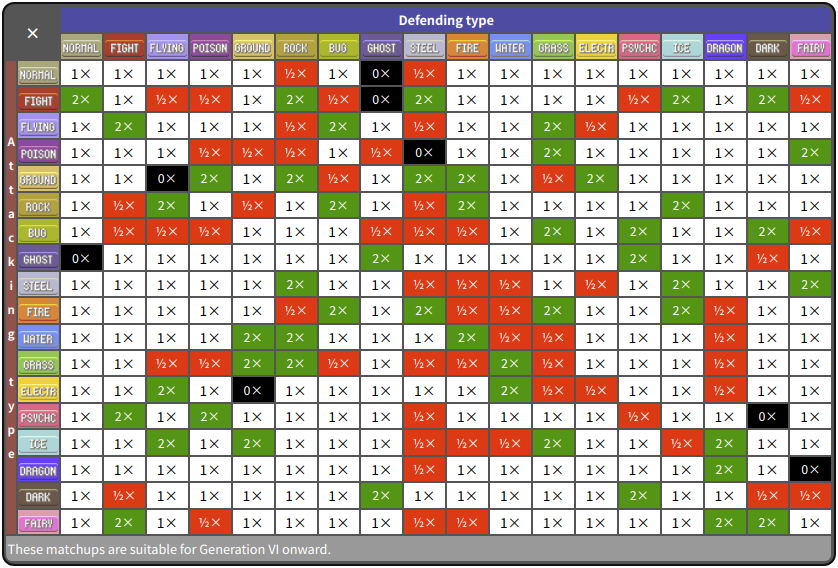

[The Pokemon Timeline Explained (in seven minutes) - YouTube](https://www.youtube.com/watch?v=VxEjr4eiSNg)
[Pokemon Timeline (New Sword and Shield Multiverse) - YouTube](https://www.youtube.com/watch?v=alxVx9TR0Ts)
[【寶可夢回憶錄】EP.38 大吾已經快五十歲?寶可夢遊戲時間線整理 日月 劍盾【SHINN】 - YouTube](https://www.youtube.com/watch?v=ZL4CiYQSG5A)
[Timeline of Pokémon - Wikiwand](https://www.wikiwand.com/en/Timeline_of_Pok%C3%A9mon)

[【SHINN 聊寶可夢】 - YouTube](https://www.youtube.com/playlist?list=PLSJJe1V0GHK5jRHbRvFaUAif84nfTlSfd)
[TheAuraGuardian - YouTube](https://www.youtube.com/channel/UCTUMam4bUNLz8mdPcaFiBpg)
[BIG BIGGG - YouTube](https://www.youtube.com/channel/UCSi3cVjbwI65gHQyfKBwIoA/featured)
[Capijun - YouTube](https://www.youtube.com/channel/UC9NXuvE2qgzT1lokLC7ycQg)
[MandJTV - YouTube](https://www.youtube.com/channel/UCSAYHSNaY5_UEol4_frPurg)

[Pokémon - Wikiwand](https://www.wikiwand.com/en/Pok%C3%A9mon)

[Pokémon Wiki | Fandom](https://pokemon.fandom.com/wiki/Pok%C3%A9mon_Wiki)
[Pokémon Database -- the fastest way to get your Pokémon information](https://pokemondb.net/)
[神奇宝贝百科，关于宝可梦的百科全书](https://wiki.52poke.com/wiki/%E4%B8%BB%E9%A1%B5)
[Bulbagarden : The original Pokémon community](https://bulbagarden.net/)
[Serebii.net - Where Legends Come To Life](https://www.serebii.net/)

[The Smart Pokemon Trainer (and Scyther) - YouTube](https://www.youtube.com/playlist?list=PLmsMGFIWAJdJ1nceYOGUO3fqUtfm3slyt)

### Videos

[寶可夢 官方 - YouTube](https://www.youtube.com/channel/UCUsB9KTwSGgPlIARzdaKb_Q)
[Pokémon Asia ENG - YouTube](https://www.youtube.com/channel/UCR1r4GPUBvdI0EJBpxKYPQQ)
[Pokémon Diamond and Pearl - YouTube](https://www.youtube.com/playlist?list=PLQo7jlHehrYOtxx1YfO2JlK4tRDDDzRGp)
[Pokémon the Series: XY - YouTube](https://www.youtube.com/playlist?list=PLQo7jlHehrYN63q0UG54AEYZmv-WsBZZX)
[Pokémon Journeys: The series | Pokémon Asia ENG - YouTube](https://www.youtube.com/playlist?list=PLQo7jlHehrYNE9PzaiGrywyGThkbwgclT)
[Pokémon Journeys | EP05 Mind-Boggling Dynamax! | Pokémon Asia ENG - YouTube](https://www.youtube.com/watch?v=tqaYgolmHwc) this is not in the playlist

[Watch Pokémon TV](https://watch.pokemon.com/en-us/#/) US only

### Types

[Type - Bulbapedia, the community-driven Pokémon encyclopedia](https://bulbapedia.bulbagarden.net/wiki/Type)  

[Type/Type chart - Bulbapedia, the community-driven Pokémon encyclopedia](https://bulbapedia.bulbagarden.net/wiki/Type/Type_chart) type effectiveness

### Games

[寶可夢系列電子遊戲列表 - Wikiwand](https://www.wikiwand.com/zh/%E5%AF%B6%E5%8F%AF%E5%A4%A2%E7%B3%BB%E5%88%97%E9%9B%BB%E5%AD%90%E9%81%8A%E6%88%B2%E5%88%97%E8%A1%A8)
[Pokémon (video game series) - Wikiwand](<https://www.wikiwand.com/en/Pok%C3%A9mon_(video_game_series)>)
[寶可夢遊戲 - 神奇宝贝百科，关于宝可梦的百科全书](https://wiki.52poke.com/wiki/%E5%AF%B6%E5%8F%AF%E5%A4%A2%E9%81%8A%E6%88%B2)
[Pokémon games - Bulbapedia, the community-driven Pokémon encyclopedia](https://bulbapedia.bulbagarden.net/wiki/Pok%C3%A9mon_games)

[Generation - Bulbapedia, the community-driven Pokémon encyclopedia](https://bulbapedia.bulbagarden.net/wiki/Generation) this affects Pokemon types and effectiveness

| 世代 | 副標題                           |                    | 遊戲舞臺                        |
| ---- | -------------------------------- | ------------------ | ------------------------------- |
| 一   | 紅／綠／藍﹔皮卡丘               |                    | 關都地區 (Kanto, 參考關東)      |
| 二   | 金／銀﹔水晶版                   |                    | 城都地區 (Johto, 參考關西/四國) |
| 三   | 紅寶石／藍寶石／綠寶石           |                    | 豐緣地區 (Hoenn, 參考九州)      |
| 三   | 火紅／葉綠                       | 紅／綠重製         | 關都地區                        |
| 四   | 鑽石／珍珠﹔白金                 |                    | 神奧地區 (Sinnoh)               |
| 四   | 心金／魂銀                       | 金／銀重製         | 城都地區                        |
| 五   | 黑／白                           |                    | 合眾地區 (Unova, 參考美國)      |
| 五   | 黑２／白２                       | 金／銀重製         | 合眾地區                        |
| 六   | X／Y                             |                    | 卡洛斯地區 (Kalos, 參考法國)    |
| 六   | 歐米加紅寶石／阿爾法藍寶石       | 紅寶石／藍寶石重製 | 豐緣地區                        |
| 七   | 太陽／月亮                       |                    | 阿羅拉地區 (Kalos, 參考夏威夷)  |
| 七   | 究極之日／究極之月               |                    | 阿羅拉地區                      |
| 七   | Let's Go！皮卡丘／Let's Go！伊布 | 皮卡丘重製         | 關都地區                        |
| 八   | 劍／盾                           |                    | 伽勒爾地區                      |
| 八   | 晶燦鑽石／明亮珍珠               | 鑽石／珍珠重製     | 神奧地區                        |
| 八   | 傳說 阿爾宙斯                    |                    | 洗翠地區 （古代神奧地區）       |

### Pokedex

[Pokédex | Pokemon.com](https://www.pokemon.com/us/pokedex/)
[寶可夢圖鑑 | The official Pokémon Website in Hong Kong](https://hk.portal-pokemon.com/play/pokedex)
[宝可梦列表（按全国图鉴编号） - 神奇宝贝百科，关于宝可梦的百科全书](https://wiki.52poke.com/wiki/%E5%AE%9D%E5%8F%AF%E6%A2%A6%E5%88%97%E8%A1%A8%EF%BC%88%E6%8C%89%E5%85%A8%E5%9B%BD%E5%9B%BE%E9%89%B4%E7%BC%96%E5%8F%B7%EF%BC%89)
[Serebii.net Pokédex Hub](https://www.serebii.net/pokemon/)
[List of Pokémon (sprites gallery) | Pokémon Database](https://pokemondb.net/pokedex/national)
[Category:Pokémon by Generation | Pokémon Wiki | Fandom](https://pokemon.fandom.com/wiki/Category:Pok%C3%A9mon_by_Generation)
[List of Pokémon by National Pokédex number - Bulbapedia, the community-driven Pokémon encyclopedia](https://bulbapedia.bulbagarden.net/wiki/List_of_Pok%C3%A9mon_by_National_Pok%C3%A9dex_number)

[Helix Chamber – Mysterious monsters](https://helixchamber.com/)

[Legendary Pokémon - Bulbapedia, the community-driven Pokémon encyclopedia](https://bulbapedia.bulbagarden.net/wiki/Legendary_Pok%C3%A9mon) 伝説のポケモン
[Mythical Pokémon - Bulbapedia, the community-driven Pokémon encyclopedia](https://bulbapedia.bulbagarden.net/wiki/Mythical_Pok%C3%A9mon) 幻のポケモン

[-Realistic Pokemon- — Art of RJ Palmer](https://www.rj-palmer.com/realistic-pokemon)
[Realistic Pokémon Biology | Part I - YouTube](https://www.youtube.com/watch?v=S-y6lcy7e9o)

[All Gender Differences in Pokémon [Generation 1 to 6] - YouTube](https://www.youtube.com/watch?v=xOMAE3aftIU)

[Literal Pokedex Entries - YouTube](https://www.youtube.com/playlist?list=PLmsMGFIWAJdJgfKNpqukhevp6ebcm2-p7)
