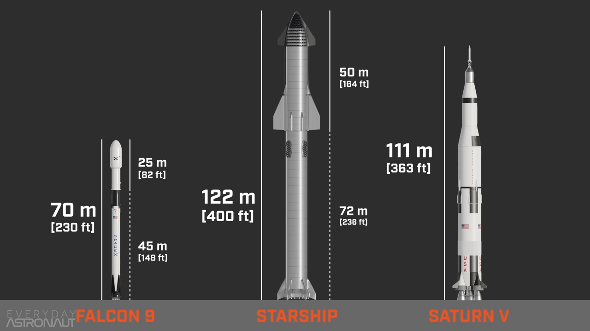

> see `astronomy.md`
> TODO: move topics to `astronomy.md`

[Space.com: NASA, Space Exploration and Astronomy News](https://www.space.com/)
[Home | NASA Space Place – NASA Science for Kids](https://spaceplace.nasa.gov/)
[Space + Science News - CNN](https://edition.cnn.com/specials/space-science)
[Spaceflight Now – The leading source for online space news](https://spaceflightnow.com/)
[The Planetary Society](https://www.planetary.org/)

[Here's the weird alphabet soup that scientists use to name stuff in space | Popular Science](https://www.popsci.com/how-scientists-name-planets-comets-asteroids/)

NASA
[NASA Documentaries - YouTube](https://www.youtube.com/playlist?list=PL2aBZuCeDwlQAGW6uo18_FMl0eIhkeOOv)
[#BackToSchool with NASA Science - YouTube](https://www.youtube.com/playlist?list=PL2aBZuCeDwlQHIpnk-mRVKL_VQCOIsCS_)

Crash Course
[Big History - YouTube](https://www.youtube.com/playlist?list=PL8dPuuaLjXtMczXZUmjb3mZSU1Roxnrey)
[Astronomy - YouTube](https://www.youtube.com/playlist?list=PL8dPuuaLjXtPAJr1ysd5yGIyiSFuh0mIL)

[The Universe, Explained: Season 1 - YouTube](https://www.youtube.com/playlist?list=PLoaVOjvkzQtx7B9LGLMDPtcT3msNVgceJ) minutephysics

[Everyday Astronaut - YouTube](https://www.youtube.com/channel/UC6uKrU_WqJ1R2HMTY3LIx5Q)
[Space - YouTube](https://www.youtube.com/playlist?list=PLgVMn8k8t5JNeGds2KjPLXh37Y2oHuKHW)
[Discovery With Andy - YouTube](https://www.youtube.com/channel/UC6lYCOXS4Rxo9xpKS1My32A)
[Xedous - YouTube](https://www.youtube.com/channel/UClvL9ZAl8V-Ixv-nLydHeFA)
[Rocket Science - YouTube](https://www.youtube.com/playlist?list=PLYu7z3I8tdEnsqbIM2XBduT79fDjisSqe)

[Live Starlink Satellite Map](https://satellitemap.space/)
[Space Junk Removal Is Not Going Smoothly - Scientific American](https://www.scientificamerican.com/article/space-junk-removal-is-not-going-smoothly/)

[Why SPACESHIPS CAN'T TURN as shown in Science Fiction - YouTube](https://www.youtube.com/watch?v=L-Of6r1DlY8)

[Why Our Solar System Is Weirder Than You'd Think - YouTube](https://www.youtube.com/watch?v=YWsWupdt5V0)
[我要搬家了，探索太陽系的時候發現了真正的 2021 預言 | 老高與小茉 Mr & Mrs Gao - YouTube](https://www.youtube.com/watch?v=so8E3Cp_OAw)

整流罩 Fairing

## Russia

[The genius behind early Russian space tech - BBC Future](https://www.bbc.com/future/article/20210415-the-genius-behind-early-russian-space-tech)

[How does the Soyuz Spacecraft work? - YouTube](https://www.youtube.com/watch?v=24Bz5Ra5RgE)
[How does the Soyuz Launch work? (and Reentry) - YouTube](https://www.youtube.com/watch?v=_v7YgDum2Sg)

## China

[毅力號背後的能源危機 - YouTube](https://www.youtube.com/watch?v=iOhQ6MjM8KE)
[毅力號#17: 火星能源系统|核能 vs 太阳能|毅力號 vs 天问一號 - YouTube](https://www.youtube.com/watch?v=3Y3mCZjMM8w)

[长征五号 B 发射成功为什么这么重要，它与之前失败的两次有何区别。中国运力最强火箭已跻身到世界前列！ - YouTube](https://www.youtube.com/watch?v=Eqyae-vcyXA) Chinese space programs, overview of rockets

## Gravity

[What is gravity? | NASA Space Place – NASA Science for Kids](https://spaceplace.nasa.gov/what-is-gravity/en/)
[5 Mind Blowing Facts About Gravity](https://interestingengineering.com/5-mind-blowing-facts-about-gravity)
[Astrophysicist Explains Gravity in 5 Levels of Difficulty | WIRED - YouTube](https://www.youtube.com/watch?v=QcUey-DVYjk)
[地球的質量是怎麼稱出來的？連牛頓都放棄了的奇葩實驗！How To【老肉雜談】 - YouTube](https://www.youtube.com/watch?v=6i0GMFAKERY) estimating mass of earth with mountain
[Why Gravity is NOT a Force - YouTube](https://www.youtube.com/watch?v=XRr1kaXKBsU) all movements are inertial linear motion in curved spacetime, gravity is a approximation in slow speed and weak field

> see `science.md#relativity.md`

[How Gravity Is a Double Copy of Other Forces | Quanta Magazine](https://www.quantamagazine.org/how-gravity-is-a-double-copy-of-other-forces-20210504/)
[Why Gravity Is Not Like the Other Forces | Quanta Magazine](https://www.quantamagazine.org/why-gravity-is-not-like-the-other-forces-20200615/)

[Physicist advances a radical theory of gravity - Big Think](https://bigthink.com/surprising-science/physicist-radical-theory-of-gravity)

## Cosmic Photos

[Pale Blue Dot - Wikiwand](https://www.wikiwand.com/en/Pale_Blue_Dot)
[Voyager 1's Pale Blue Dot | NASA Solar System Exploration](https://solarsystem.nasa.gov/resources/536/voyager-1s-pale-blue-dot/)

[Earthrise - Wikiwand](https://www.wikiwand.com/en/Earthrise)
[Apollo 8’s Earthrise: The Shot Seen Round the World - The New York Times](https://www.nytimes.com/2018/12/21/science/earthrise-moon-apollo-nasa.html?module=inline)

## Solar Probe

Parker Solar Probe

[Parker Solar Probe | NASA](https://www.nasa.gov/content/goddard/parker-solar-probe)
[Parker Solar Probe - Wikiwand](https://www.wikiwand.com/en/Parker_Solar_Probe)

[Traveling to the sun: Why won't Parker Solar Probe melt?](https://phys.org/news/2018-07-sun-wont-parker-solar-probe.amp)
[Parker Solar Probe Countdown to T-Zero for a Journey to “Touch” the Sun - YouTube](https://www.youtube.com/watch?v=tvgrXBoQY_M)
[NASA's Parker Solar Probe Touches The Sun For The First Time - YouTube](https://www.youtube.com/watch?v=LkaLfbuB_6E)
[NASA's Spacecraft "Touched The Sun" - What Does That Mean? - YouTube](https://www.youtube.com/watch?v=qS5Z9FdKeso)

## EmDrive

Which violates conservation of momentum

[The EmDrive Experiments Were Junk - Ask a Spaceman! - YouTube](https://www.youtube.com/watch?v=HrNs53qRaUs)

['Impossible' Space Engine Might Actually Work, Study Suggests | Space](https://www.space.com/34672-impossible-space-engine-emdrive-test.html)
[Can the EmDrive actually work for space travel? | Live Science](https://www.livescience.com/amp/can-emdrive-space-propulsion-concept-work.html)

## Krypton Ion Thruster

[一个屁都不如的推力 却能把星链卫星加速到 30000 公里每小时 【星链卫星的氪离子推进器】 - YouTube](https://www.youtube.com/watch?v=3iUy4-LFM90)

## Fermi Paradox

[Fermi paradox - Wikiwand](http://www.wikiwand.com/en/Fermi_paradox)

[最神奇的星球，地球以及人類存在的真正原因 | 老高與小茉 Mr & Mrs Gao - YouTube](https://www.youtube.com/watch?v=BLpv9fCZqcs)
[【費米悖論】人類至今無法發現外星人的 14 種可能，越往後可能性越大 | 老高與小茉 Mr & Mrs Gao - YouTube](https://www.youtube.com/watch?v=N4xXGIrzKJs)

[The Fermi Paradox - Wait But Why](https://waitbutwhy.com/2014/05/fermi-paradox.html)
[The Fermi Paradox — Where Are All The Aliens? (1/2) - YouTube](https://www.youtube.com/watch?v=sNhhvQGsMEc)
[The Fermi Paradox II — Solutions and Ideas – Where Are All The Aliens? - YouTube](https://www.youtube.com/watch?v=1fQkVqno-uI)
[Why Alien Life Would be our Doom - The Great Filter - YouTube](https://www.youtube.com/watch?v=UjtOGPJ0URM)

[How Stars May Have Just Solved The Fermi Paradox - YouTube](https://www.youtube.com/watch?v=UJI3HYmRe8A)

## 人類文明

[人擇原理 - Wikiwand](https://www.wikiwand.com/zh-hk/%E4%BA%BA%E6%8B%A9%E5%8E%9F%E7%90%86)
[Anthropic principle - Wikiwand](https://www.wikiwand.com/en/Anthropic_principle)
[人擇宇宙學原理 - MBA 智库百科](https://wiki.mbalib.com/zh-tw/%E4%BA%BA%E6%8B%A9%E5%AE%87%E5%AE%99%E5%AD%A6%E5%8E%9F%E7%90%86)

[宇宙等級 7 級論：人類文明發展至今，竟還處於 0 級？| 宇宙文明等級科普（上）「曉涵哥來了」 - YouTube](https://www.youtube.com/watch?v=BTfWpcSIkQU)
[宇宙文明第 7 級到底有多可怕？5 級文明已經是神一般的存在了| 宇宙文明等級科普（下）「曉涵哥來了」 - YouTube](https://www.youtube.com/watch?v=MTCrzBVNJjc)

## Asteroids/Comets/Meteoroids/Meteors

Asteroids had circular orbits, sized between 1m to 500km, were made of **rock and metal** and lived in the asteroid belt between Mars and Jupiter.
Comets had inclined elliptical orbits, were made of **dust, rock and ice**, when the sun is formed for and came from further away
Meteoroids are broken parts of asteroids or comets
Meteors are meteoroids that enters the Earth's atmosphere
Meteorites are meteors that are not vaporized and landed on the Earth's surface
[Centaur (small Solar System body) - Wikiwand](<https://www.wikiwand.com/en/Centaur_(small_Solar_System_body)>)
Kuiper Belt, Oort cloud, Mostly icy
[Who Protects Earth From Asteroids?](https://gizmodo.com/who-protects-earth-from-asteroids-1836193730)
[Difference between Asteroids and Meteorites](https://interestingengineering.com/difference-between-asteroids-and-meteorites)
[Asteroid or Meteor: What's the Difference? | NASA Space Place – NASA Science for Kids](https://spaceplace.nasa.gov/asteroid-or-meteor/en/)
[The difference between asteroids and meteorites](https://phys.org/news/2015-06-difference-asteroids-meteorites.html)
[Overview | Meteors & Meteorites – NASA Solar System Exploration](https://solarsystem.nasa.gov/asteroids-comets-and-meteors/meteors-and-meteorites/overview/)
[Astronomy and Nature TV - YouTube](https://www.youtube.com/channel/UCIwQ5bWXAf57sE5HN6ldW3Q)
[Space - YouTube](https://www.youtube.com/playlist?list=PLgVMn8k8t5JNeGds2KjPLXh37Y2oHuKHW) 3D Animations
[流星雨是如何产生的？英仙座流星雨又来啦！ - YouTube](https://www.youtube.com/watch?v=qQ3ubHntk5c)
[關於彗星的秘密：生也彗星，亡也彗星「曉涵哥來了」 - YouTube](https://www.youtube.com/watch?v=yZsUb2d4M6I) Project Rosetta
[Are there centaurs in outer space? • Daniel and Jorge Explain the Universe - Podcast Addict](https://podcastaddict.com/episode/116943172)

## Space Station

[中国来了！世界看见了中国速度，神舟十三号出发在即！世界空间站的震撼发展史 - YouTube](https://www.youtube.com/watch?v=h3smAt6WSOQ)
[International Space Station Construction Videos - YouTube](https://www.youtube.com/playlist?list=PLYu7z3I8tdEnjgkBIBgxaJfZl2LdQN-rP)

[Salyut programme - Wikiwand](https://www.wikiwand.com/en/Salyut_programme) 1971-1986

[Skylab - Wikiwand](https://www.wikiwand.com/en/Skylab) 1973-1974

[Mir - Wikiwand](https://www.wikiwand.com/en/Mir) 1986-2001

[International Space Station - Wikiwand](https://www.wikiwand.com/en/International_Space_Station) 1998-
[Assembly of the International Space Station - Wikiwand](https://www.wikiwand.com/en/Assembly_of_the_International_Space_Station)
[What Is the International Space Station? | NASA](https://www.nasa.gov/audience/forstudents/5-8/features/nasa-knows/what-is-the-iss-58.html)
[History and Timeline of the ISS](https://www.issnationallab.org/about/iss-timeline/)
[How does the International Space Station work? - YouTube](https://www.youtube.com/watch?v=oLrOnEmy_GA)

[Tiangong space station - Wikiwand](https://www.wikiwand.com/en/Tiangong_space_station) 2021-

## Earth Orbits

### Low Earth Orbit (LEO)

160-2000km above earth's surface

[Project Gemini - Wikiwand](https://www.wikiwand.com/en/Project_Gemini)
Cold war, uses Titan II, a modified Intercontinental Ballistic Missile (ICBM), as launch vehicle

### Geosynchronous Orbit/Geostationary Orbit

35786km above equator

### Medium Earth Orbit

2000-35700km above earth's surface

Satellite Navigation Systems

## Satellite Navigation Systems

[Satellite navigation - Wikiwand](https://www.wikiwand.com/en/Satellite_navigation)
[The Beginner's Guide to Different Satellite Navigation Systems](https://linxtechnologies.com/wp/blog-post/beginners-guide-satellite-navigation-systems/)

[手机定位和导航是啥原理？GPS 和北斗有啥区别？李永乐老师讲卫星定位（2018 最新） - YouTube](https://www.youtube.com/watch?v=Rhq18MV6LtU)
[中国北斗有多厉害？GPS 的霸主地位动摇，欧美体验到什么是中国速度 - YouTube](https://www.youtube.com/watch?v=8sWccq_QzKw&t=1s)

## Moon

> see `moon-story.md`

## Voyager

[What Did Nasa's Voyager 1 Really Discover... - YouTube](https://www.youtube.com/watch?v=ihjYml4bleI)
[We decoded NASA’s messages to aliens by hand - YouTube](https://www.youtube.com/watch?time_continue=45&v=RRuovINxpPc)

[How to decode the images on the Voyager Golden Record / Boing Boing](https://boingboing.net/2017/09/05/how-to-decode-the-images-on-th.html)
[First Ever Decode of Voyager Audio Images, in Real Time. - YouTube](https://www.youtube.com/watch?v=ibByF9XPAPg)

[aizquier/voyagerimb: Voyager's Golden Disk Image Browser](https://github.com/aizquier/voyagerimb)
[Voyager Golden Record: encoded image data by Ozma Records](https://soundcloud.com/user-482195982/voyager-golden-record-encoded-images)

[【震撼】距離地球最遙遠的人造物，航海家 1 號 | 老高與小茉 Mr & Mrs Gao - YouTube](https://www.youtube.com/watch?v=UZHGEyCYgTc)

## Mars

[Watch InSight Landing On Mars | Ars Technica Video | CNE](http://video.arstechnica.com/watch/insight-landing-on-mars)

[Missions | Mars Exploration Section – NASA’s Mars Exploration Program](https://mars.nasa.gov/mars-exploration/missions/?page=0&per_page=99&order=date+desc&search=)
[火星探索简史 - YouTube](https://www.youtube.com/playlist?list=PLyixzVkhAYT5q3y5Y2Q0u-MVpyaWbg9bf)

### Rovers

[Why NASA's Mars Rovers Were Not Equipped With Solar Panels - YouTube](https://www.youtube.com/watch?v=fSIhNMYB9E0)
[File:PIA22835-MarsProbes-SingleSolGeneratedEnergy-20181130-corrected.png - Wikipedia](https://en.wikipedia.org/wiki/File:PIA22835-MarsProbes-SingleSolGeneratedEnergy-20181130-corrected.png)
[Mars Rover Landing CRASH COURSE- 3 DAYS LEFT! - YouTube](https://www.youtube.com/watch?v=tH2tKigOPBU)

[Mars Pathfinder - NASA Mars](https://mars.nasa.gov/programmissions/missions/past/pathfinder/)
[Mars Pathfinder - Wikiwand](https://www.wikiwand.com/en/Mars_Pathfinder) 1997

Spirit and Opportunity are MER twins; designed for a mission of 90 martian days (sol), lasted for more than 7 and 14 years
[How NASA's Opportunity and Spirit Rovers Changed Mars Exploration Forever | Space](https://www.space.com/mars-rovers-opportunity-spirit-change-exploration.html)
[Mars Exploration Rovers - Spirit and Opportunity | NASA](https://www.nasa.gov/mission_pages/mer/index.html)
[Mars Exploration Rovers - NASA Mars](https://mars.nasa.gov/mer/)
[Spirit (rover) - Wikiwand](<https://www.wikiwand.com/en/Spirit_(rover)>) 2003 MER-A; stopped working in 2010 after trapping in sand dune
[Opportunity (rover) - Wikiwand](<https://www.wikiwand.com/en/Opportunity_(rover)>) 2004 MER-B; shut down due to record breaking dust storm late 2018
[Mars Opportunity Rover - YouTube](https://www.youtube.com/watch?v=GKnZrueYRAY) air bags
[How we landed on Mars with NASA Spirit - YouTube](https://www.youtube.com/watch?v=6t3IARmIdOI)
[The Desperate Last-Ditch Efforts to Save Opportunity - YouTube](https://www.youtube.com/watch?v=4tNxRssrgDk)

[Mars Science Laboratory](https://mars.nasa.gov/msl/)
[Curiosity (rover) - Wikiwand](<https://www.wikiwand.com/en/Curiosity_(rover)>) 2011

- first to use sky crane system
- Equipped with Radioisotope Thermoelectric Generator (RTG)

[Mars Science Laboratory - Curiosity Rover | NASA](https://www.nasa.gov/mission_pages/msl/index.html)
[NASA Mars Science Laboratory (Curiosity Rover) Mission Animation [HDx1280] - YouTube](https://www.youtube.com/watch?v=gwinFP8_qIM)
[7 Minutes of Terror: Curiosity Rover's Risky Mars Landing | Video - YouTube](https://www.youtube.com/watch?v=h2I8AoB1xgU)
[NASA - Mars Curiosity Entry/Decent and Landing "7 Minutes of Terror!" Full Story! (HD) - YouTube](https://www.youtube.com/watch?v=L9pIy3xSw1I)
[The Curiosity Rover Landing - YouTube](https://www.youtube.com/watch?v=a4YqNoLkmxE) power descent (super sonic retro propulsion), sky crane
[The Computers Behind NASA's Mars Curiosity Rover - YouTube](https://www.youtube.com/watch?v=1eUddT5BJ78)

[Perseverance (rover) - Wikiwand](<https://www.wikiwand.com/en/Perseverance_(rover)>) 2021
[Ingenuity (helicopter) - Wikiwand](<https://www.wikiwand.com/en/Ingenuity_(helicopter)>)
[Ingenuity Is So Good, NASA's Mars Helicopter Mission Just Got an Exciting Update](https://www.sciencealert.com/remember-nasa-s-little-mars-copter-it-s-still-going-strong)
[The Insane Engineering of the Perseverance Rover - YouTube](https://www.youtube.com/watch?v=yqqaW8DCc-I)

- twin of Curiosity Rover
- also uses sky crane system
- with Ingenuity helicopter, first rotor-powered flying object beyond Earth

[毅力號系列 - YouTube](https://www.youtube.com/playlist?list=PLyixzVkhAYT7qhBHCNnrkgi3qfYdiUXg2)
[中国“天问一号”有多厉害？它将挑战欧美之前没能完成的火星任务 - YouTube](https://www.youtube.com/watch?v=6VtD_zlarJ4)
[入轨！“天问一号”频传捷报，美国“毅力号”成功着陆，中美火星争霸正式开启！MARS! China vs USA 2021 - YouTube](https://www.youtube.com/watch?v=1J8pebfQD1E)

[Mars Perseverance Rover | NASA](https://www.nasa.gov/perseverance)
[Mars 2020 Perseverance Rover - NASA Mars](https://mars.nasa.gov/mars2020/)
[Mars 2020 Perseverance Rover - What's Different This Time? A Narrated Explanation. - YouTube](https://www.youtube.com/watch?v=95hMM2u6Fgw)
[How NASA's next-gen Perseverance Mars rover tops older sibling Curiosity - CNET](https://www.cnet.com/google-amp/news/how-nasas-next-gen-perseverance-mars-rover-tops-its-older-sibling-curiosity/)
[First Flight on Another Planet! - YouTube](https://www.youtube.com/watch?v=GhsZUZmJvaM)
[The Insane Engineering of the Perseverance Rover - YouTube](https://www.youtube.com/watch?v=yqqaW8DCc-I&feature=emb_rel_pause)

### Landers

Viking 1975

[Phoenix - NASA Mars](https://mars.nasa.gov/programmissions/missions/past/phoenix/)
[Phoenix (spacecraft) - Wikiwand](<https://www.wikiwand.com/en/Phoenix_(spacecraft)>) 2008
[Phoenix Mars Landing: Nerves and Joy - YouTube](https://www.youtube.com/watch?v=hH5pNFROlYU)
[火星探索簡史(第五集)：火星上的不死鳥 - YouTube](https://www.youtube.com/watch?v=VndsX5_5zMk)

[InSight - Wikiwand](https://www.wikiwand.com/en/InSight) 2018
[Entry, Descent, and Landing | Landing – NASA's InSight Mars Lander](https://mars.nasa.gov/insight/timeline/landing/entry-descent-landing/)
[NASA InSight landing: Watch as the spacecraft successfully lands on Mars - YouTube](https://www.youtube.com/watch?v=A9Q-pXVISD4)
[Watch NASA land INSIGHT on Mars!!!! - YouTube](https://www.youtube.com/watch?v=BRj3la_i9a4)

## Space drive

[NASA Engineer Has A Great Idea for a High-Speed Spacedrive. Too Bad it Violates the Laws of Physics - Universe Today](https://www.universetoday.com/143741/nasa-engineer-has-a-great-idea-for-a-high-speed-spacedrive-too-bad-it-violates-the-laws-of-physics/)

[Was Physics Really Violated By EM Drive In "Leaked" NASA Paper? - Universe Today](https://www.universetoday.com/131895/physics-really-violated-em-drive-leaked-nasa-paper/)

## Rockets

> see `engines.md#rocket-engine`

Max-Q: maximum aerodynamic pressure a flying object can withstand

Delta-V maps
[Hohmann transfer orbit - Wikiwand](https://www.wikiwand.com/en/Hohmann_transfer_orbit)
[Gravity assist - Wikiwand](https://www.wikiwand.com/en/Gravity_assist)

Single Stage to Orbit (SSTO)

[It's Rocket Science! with Professor Chris Bishop - YouTube](https://www.youtube.com/watch?v=HESOat2iPzU)

[HOW ROCKETS ARE MADE (Rocket Factory Tour - United Launch Alliance) - Smarter Every Day 231 - YouTube](https://www.youtube.com/watch?v=o0fG_lnVhHw)
[Rockets 101 | National Geographic - YouTube](https://www.youtube.com/watch?v=1yBwWLunlOM)

[NASA 隱瞞的秘密，人性道德與利益的取舍？「曉涵哥來了」 - YouTube](https://www.youtube.com/watch?v=8qMe9D_XZ1I)

## Space Shuttle

[Space Shuttle: Final Countdown (NASA) | History Documentary | Reel Truth History - YouTube](https://www.youtube.com/watch?v=BSl6WiwCtlg)
[How did the Space Shuttle launch work? - YouTube](https://www.youtube.com/watch?v=oMeXcBk1x-c)
[How did the Orbiter Vehicle work? (Space Shuttle) - YouTube](https://www.youtube.com/watch?v=cFBRawYov00)
Enterprise (testing vehicle on Earth)
Challenger (accident in 1986, O-ring leaked fuel and causing explosion during launch)
Columbia (accident upon return in 2003 due to thermal tile hit off by shard during launch)
Discovery
Atlantis
Endeavour
US terminate all shuttle space program in 2011

[How to Land the Space Shuttle... from Space - YouTube](https://www.youtube.com/watch?v=Jb4prVsXkZU)

Heat generated at re-entry goes up by the cube of velocity.

## Space Suit

[中国 5000 万 美国 10 亿 全球只有中俄美三国能制造的航天服怎么来的？【上集】ONLY China Russia USA can make space suits（2021）@布解探秘 - YouTube](https://www.youtube.com/watch?v=44o9HmAHxbs)
[美国 10 亿一套，中国只要 5000 万，美国航天服为什么贵的离谱？（2021）@布解探秘 - YouTube](https://www.youtube.com/watch?v=p3wb6QCoXqU)
[中国空间站首次太空行走，价值 3000 万的航天服和自动机械臂相继亮相 China Space Station's first spacewalk（2021）@布解探秘 - YouTube](https://www.youtube.com/watch?v=eN5nIJqaQY4)

## SpaceX

Brings software development philosophy (quick and cheap prototyping, scalability) to building rockets.

[解锁馬斯克的星艦飛船，為什麼前往火星是一次有去無回的旅途？「曉涵哥來了」 - YouTube](https://www.youtube.com/watch?v=1gb8Ayf3JWE)
[(Almost) Every SpaceX Landing, In Order - YouTube](https://www.youtube.com/watch?v=AllaFzIPaG4)

[Starbase Tour with Elon Musk [PART 1] - YouTube](https://www.youtube.com/watch?v=t705r8ICkRw)
[Starbase Tour with Elon Musk [PART 2] - YouTube](https://www.youtube.com/watch?v=SA8ZBJWo73E)
[Starbase Launchpad Tour with Elon Musk [PART 3] - YouTube](https://www.youtube.com/watch?v=9Zlnbs-NBUI)

Starship Launch System (SLS), using Superheavy as first stage booster
[Why Elon Musk's Big, Shiny Starship Sparked a Passive-Aggressive Fight with NASA | Live Science](https://www.livescience.com/starship-crew-dragon-spacex-nasa-bridenstine.html)
[Complete Guide To Starship: Falcon 9 VS Starship. What's new? What's different? - YouTube](https://www.youtube.com/watch?v=-8p2JDTd13k)
[SLS VS Starship: Why does SLS still exist?! - YouTube](https://www.youtube.com/watch?v=KA69Oh3_obY)
[How SpaceX and Boeing will get Astronauts to the ISS - YouTube](https://www.youtube.com/watch?v=RqLNIBAroGY)
[Starship - YouTube](https://www.youtube.com/playlist?list=PLBQ5P5txVQr9_jeZLGa0n5EIYvsOJFAnY) SN8 began to trial flip landing
[What's Inside The SpaceX Starship? - YouTube](https://www.youtube.com/watch?v=OKy2Z2BnyU8)

Falcon

- 9 (or 27 for Falcon HeavY) Merlin 1D engines as first stage
- 27 Falcon
- M-Vac (vacuum optimized Merlin engine) as first stage
- payload volume: 5m x 14m (145m³)
- 2219 aluminum alloy + carbon composite

Starship

- Raptor engines
- payload volume: 9m x 18m (1000m³)
- 304L/30X stainless steel

## SpiceyPy

[Welcome to SpiceyPy’s documentation! — SpiceyPy documentation](https://spiceypy.readthedocs.io/en/master/index.html)
[Lessons — SpiceyPy documentation](https://spiceypy.readthedocs.io/en/master/lessonindex.html)
[Space Science with Python — A Data Science Tutorial Series | by Thomas Albin | Space Science in a Nutshell | Medium](https://medium.com/space-science-in-a-nutshell/space-science-with-python-a-data-science-tutorial-series-57ad95660056)

[NAIF](https://naif.jpl.nasa.gov/naif/)
[NAIF CSPICE Toolkit Hypertext Documentation](https://naif.jpl.nasa.gov/pub/naif/toolkit_docs/C/)

[Discover the role of Python in space exploration - Learn | Microsoft Docs](https://docs.microsoft.com/en-us/learn/paths/introduction-python-space-exploration-nasa/)
[Space Science with Python — A Data Science Tutorial Series | by Thomas Albin | Space Science in a Nutshell | Medium](https://medium.com/space-science-in-a-nutshell/space-science-with-python-a-data-science-tutorial-series-57ad95660056)
